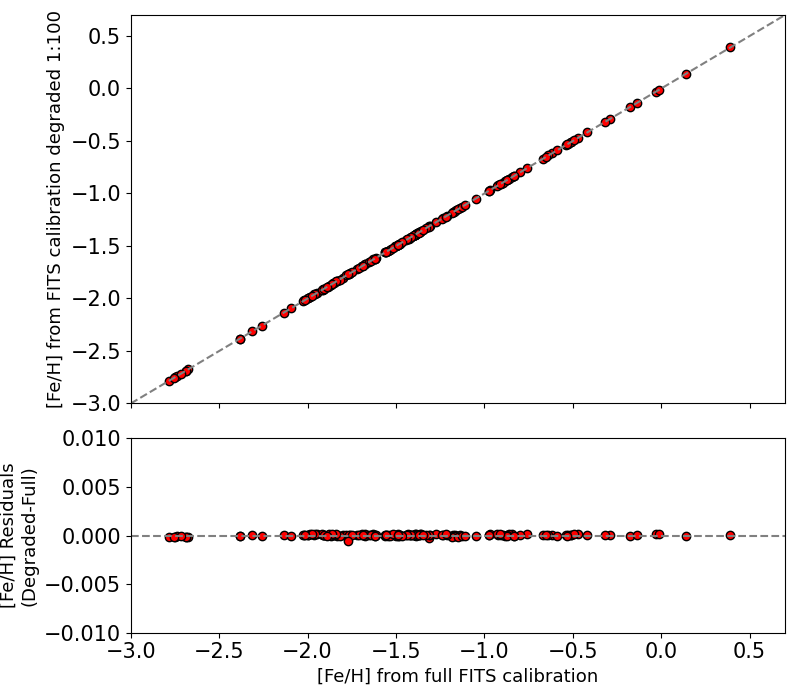

Installation
=================

You can clone the code for this package from the command line:

.. code-block:: python

  git clone https://github.com/mwanakijiji/rrlfe.git

(A ``pip install`` option will come in the future.)

As a net step, we highly recommend that you create a compartmentalized software environment, inside of which
you can install all the right versions of various software packages that ``rrlfe`` relies on, and without interfering
with other installations on your local system.

To create a new environment with conda, see the instructions `here <https://conda.io/projects/conda/en/latest/user-guide/tasks/manage-environments.html>`_,
using Python version 3.6.6 at the step \`\`To create an environment with a specific version of Python\`\`.

When you have created and activated the new environment, install the requirements for ``rrlfe`` with pip:

.. code-block:: python

  pip install -r requirements.txt

Now, follow the instructions `here <https://github.com/czwa/robospect.py>`_ to install
Robospect. Clone the code into the same parent directory in which the ``rrlfe``
package resides.

Change to the robospect.py/tmp/ directory and copy the file ll to it:

.. code-block:: python

  cp ../../rrlfe/ll .

This file tells Robospect which absorption lines
to look for.

That's it! You're ready to roll. If you would ever like to file an issue on the ``rrlfe`` Github repo, you can do so `here <https://github.com/mwanakijiji/rrlfe/issues>`_.

Note: The repository code contains a 3 Mb FITS file, which contains a calibration solution corresponding to that in the paper [TBD], except that it is a 1:100 
undersampling of the posterior chain links. Using the 'degraded' version provided, however, produces 
[Fe/H] retrievals which differ negligibly from those using the full, 300 Mb calibration file. (The full calibration file is available on request.) 

Below is a plot showing how the answers differ. The variation is well below typical [Fe/H] uncertainties of ~0.15

